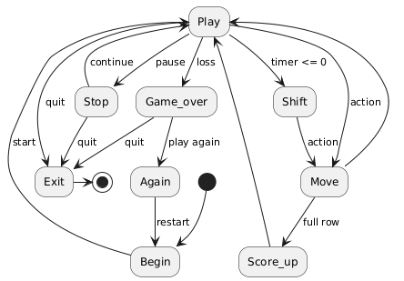

# Tetris

## Controls
```s``` — start  
```p``` — pause  
```q``` — exit  
```Left arrow``` — move piece to the left  
```Right arrow``` — move piece to the right  
```Down arrow``` — accelerate piece  
```Up arrow``` — rotate piece  
```Space``` — drop piece  

## Installation

```git clone XXX && cd C7_BrickGame_v1.0-1/src```

## Make

```make``` - build & run tetris  
```make install``` - build tetris  
```make uninstall``` - remove tetris  
```make run``` - run tetris  
```make clean``` - clean all generated files  
```make dist``` - create archive with the game's source code  
```make test``` - run tests  
```make dvi``` - generate documentation  
```make gcov_report``` - generate code coverage report  

## FSM diagram 


